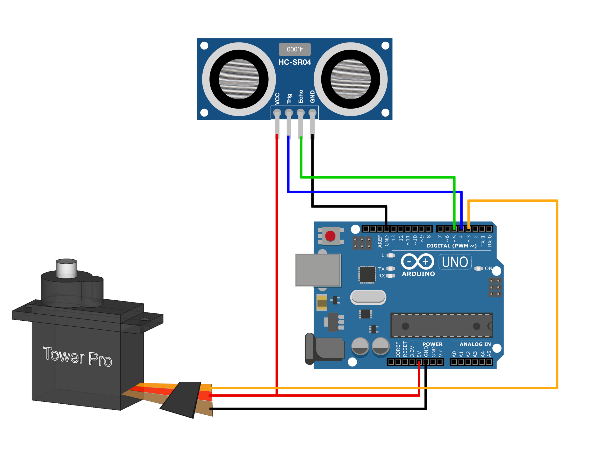
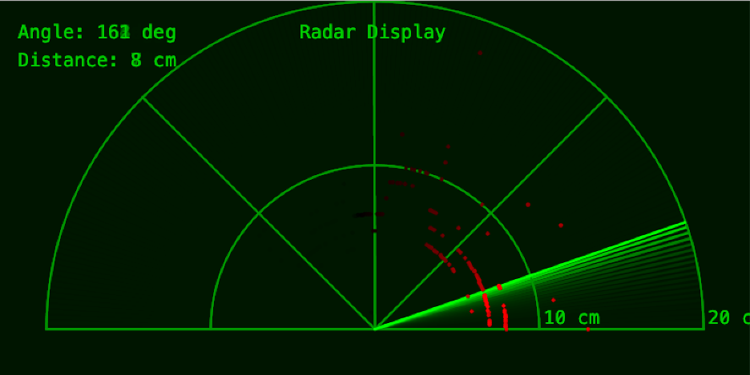

## 🛰️ IoT Radar System using Arduino & Processing
## 📌 Overview
This project implements a low-cost radar system using Arduino that detects objects in its surroundings using an ultrasonic sensor. The detected data is transmitted via serial communication and visualized in real-time using Processing, creating a radar-like interface.

## 🎯 Key Features
- 📡 Real-time object detection using ultrasonic sensor
- 🔄 180° scanning using servo motor
- 🖥️ Live radar visualization using Processing
- ⚡ Lightweight, efficient, and low-cost implementation

## 🛠️ Tech Stack
- Hardware: Arduino Uno, HC-SR04 Ultrasonic Sensor, Servo Motor
- Software: Arduino IDE, Processing IDE
- Communication: Serial Communication

## 🧩 Project Structure
```
arduino-radar-system/ 
├── arduino/
        └── radar.ino\ 
├── processing/
        └── radar_visualization.pde 
├── assets/
        └── circuit.png 
        └── output.png
└── README.md
```

## ⚙️ How It Works
1. The servo motor rotates the ultrasonic sensor from 0° to 180°
2. At each angle, distance to nearby objects is measured
3. Arduino sends angle + distance data via serial communication
4. Processing reads the data and renders a radar-style visualization

## 🔗 System Flow
Arduino → Serial Communication → Processing → Radar Visualization

## 📷 Circuit Diagram


## 📊 Output Visualization


## ▶️ How to Run
    🔹 Step 1: Arduino
        1. Open arduino/radar.ino in Arduino IDE
        2. Select correct board and COM port
        3. Upload code to Arduino
    
    🔹 Step 2: Processing
        1. Open processing/radar_visualization.pde in Processing IDE
        2. Install Serial library (if not already available)
        3. Update COM port in code:
        4. Serial myPort = new Serial(this, "COM3", 9600);
        5. Run the sketch

## ⚠️ Important Notes
- Ensure both Arduino and Processing use the same baud rate
- Update COM port according to your system
- Keep serial monitor closed while running Processing

## 🔮 Future Improvements
- Add wireless communication (Bluetooth / WiFi)
- Improve UI with better graphics
- Increase detection accuracy
- Integrate with mobile or web dashboard

## 👨‍💻 Author
Kavyansh Jain B.Tech CSE | BIT Mesra | AIML | Data Science | IOT

## ⭐ Support
If you found this project useful, consider giving it a ⭐ on GitHub!